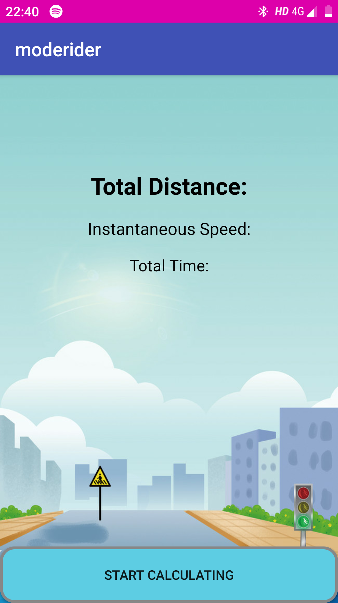
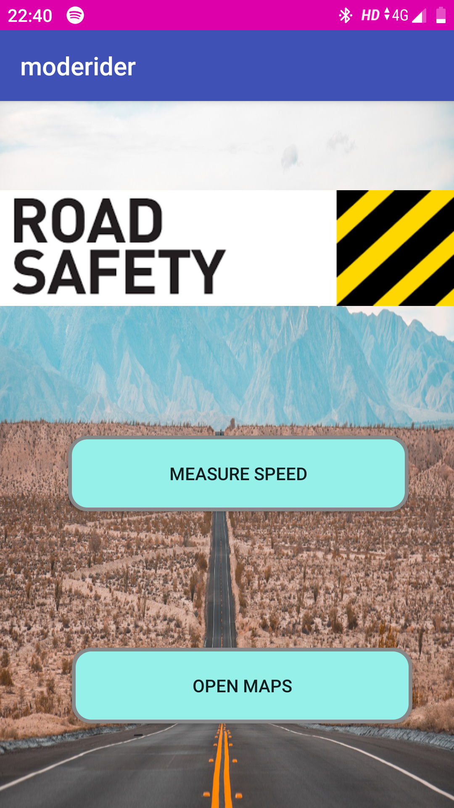

# ModeRider

This is a RoadSafety app, which recognises the Instantaneous speed, distance travelled and the total time of the user. The app gives notification when the user crosses 60 km/hr. This app was created for Audit course(sem III) on a topic of Road Safety.

                                                                      
